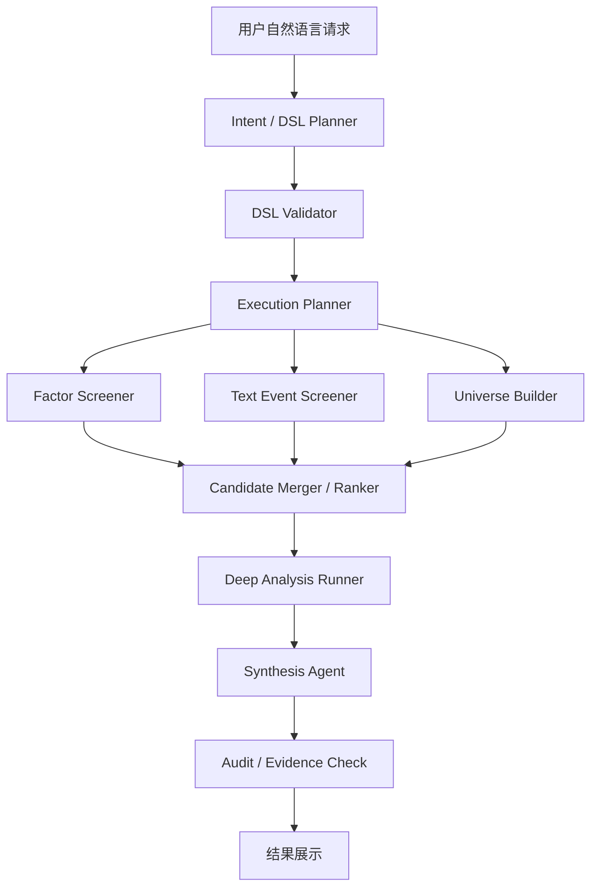

# Smart Stock Screening Plan

Date: 2026-06-01

## Goal

新增“智能选股”能力：用户用自然语言描述筛选逻辑，系统先把自然语言转换成受控 DSL，再由后端工具查询 MongoDB 和必要的派生数据，返回候选股票、命中原因、证据链和风险提示。

第一版重点不是让大模型直接自由查库，而是建立可测试、可审计、可扩展的选股执行链。

## Scope

第一阶段数据源聚焦：

- TuShare
- AKShare
- MongoDB 中已有基础数据和后续派生数据

第一阶段不引入：

- iFinD / Choice / Wind 订阅依赖
- LLM 直接执行 MongoDB 查询
- LLM 直接执行任意 Python 代码
- `stock_factor_latest`
- `stock_text_signals_latest`

## Data Layers

```text
基础事实层
stock_daily_quotes
stock_financial_data
stock_news
market_quotes

派生特征层
stock_daily_factors
stock_text_events

智能选股层
自然语言 -> DSL -> 工具执行 -> 候选股排序 -> 证据链 -> 大模型解释
```

说明：

- `stock_daily_quotes` 是历史行情事实表。
- `stock_financial_data` 是财务、估值、基本面事实表。
- `stock_news` 是新闻、公告、研报、资讯原始文本。
- `market_quotes` 是盘中实时行情，不作为收盘后历史行情权威来源。
- `stock_daily_factors` 从行情和财务数据派生，用于技术面、估值、财务筛选。
- `stock_text_events` 从文本中抽取事件明细，用于公告、新闻、研报、行业事件筛选。

## Architecture



## Roles

### LLM

- 理解用户自然语言。
- 生成受控 DSL。
- 解释筛选结果和风险。
- 不直接读 MongoDB。
- 不直接写任意查询代码。

### DSL Validator

- 校验字段是否合法。
- 校验操作符是否合法。
- 校验日期、窗口、排序、股票池是否明确。
- 对歧义请求返回澄清问题。

### run_stock_screening_by_dsl

这是暴露给大模型的受控工具。

职责：

- 接收 DSL。
- 选择执行路径。
- 查询 MongoDB 或动态计算指标。
- 返回候选股票、命中字段、证据来源、数据缺口。

它是自然语言和数据库之间的安全边界。

### Existing Analysts

现有 market / fundamentals / news analyst 不用于全市场逐只扫描。

第一版策略：

- 先由 DSL 工具筛出候选股。
- 只对 Top N 候选股调用现有分析师做深度分析。
- 最后由综合 agent 汇总。

## Execution Modes

| Mode | Use Case | Source |
| --- | --- | --- |
| `historical_factor` | 标准历史因子、指定日期或窗口 | `stock_daily_factors` |
| `dynamic_price_calc` | 未预计算的行情窗口或自定义指标 | `stock_daily_quotes` |
| `dynamic_financial_calc` | 未预计算的财务组合指标 | `stock_financial_data` |
| `text_event_search` | 新闻、公告、研报、政策、事件条件 | `stock_text_events` / `stock_news` |
| `realtime_alert` | 盘中异动和实时盯盘 | `market_quotes` |
| `deep_analysis` | Top N 候选股深度分析 | 现有 analysts/tools |
| `unsupported_or_needs_confirmation` | 字段缺失或语义不明确 | 返回澄清问题 |

## DSL Principles

DSL 不是固定几个按钮，而是一个受控表达系统。

它要支持：

- 排名条件：`top_percentile`、`top_n`
- 窗口条件：`return_5d`、`return_10d`、指定日期区间收益
- 字段比较：`close > ma5 > ma10`
- 排除条件：非 ST、非停牌、上市不足 N 日排除
- 股票池：全市场、行业、板块、watchlist
- 文本事件：业绩超预期、订单增长、减持、监管、行业政策、研报观点
- 混合条件：技术面 + 基本面 + 文本事件 + 行业主题

## First Deliverable

第一版不直接追求完整智能体体验，而是先形成一个可靠后端闭环：

```text
自然语言样例
-> 人工/LLM 生成 DSL
-> DSL 校验
-> 执行计划
-> 固定样例数据测试
-> Mongo 查询/动态计算
-> 返回候选股和证据
```

## Harness Requirements

每个阶段必须配套测试：

- DSL schema 单元测试
- DSL golden tests
- 执行计划测试
- Mongo 查询构造测试
- 固定样例数据筛选测试
- 文本事件防未来数据测试
- API contract smoke
- 前端关键流程测试

## Open Questions

- 第一版是否先支持 A 股，还是 A 股 + 美股同时支持。
- `stock_daily_factors` 的首批字段清单。
- `stock_text_events` 的事件类型枚举。
- 是否先只做 watchlist + 指定行业，后做全市场。
- 是否需要独立的智能选股页面，还是先放在现有筛选页增强。

